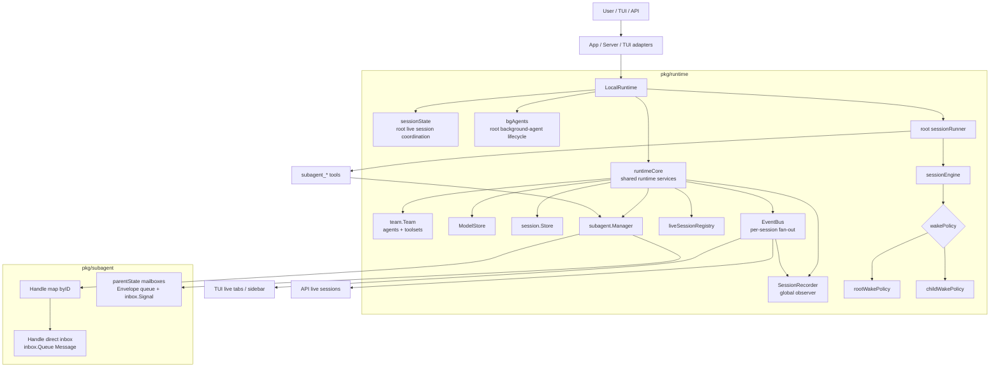
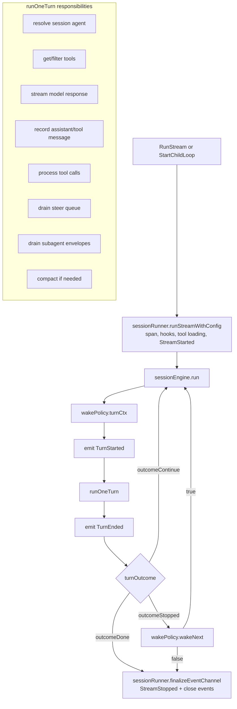
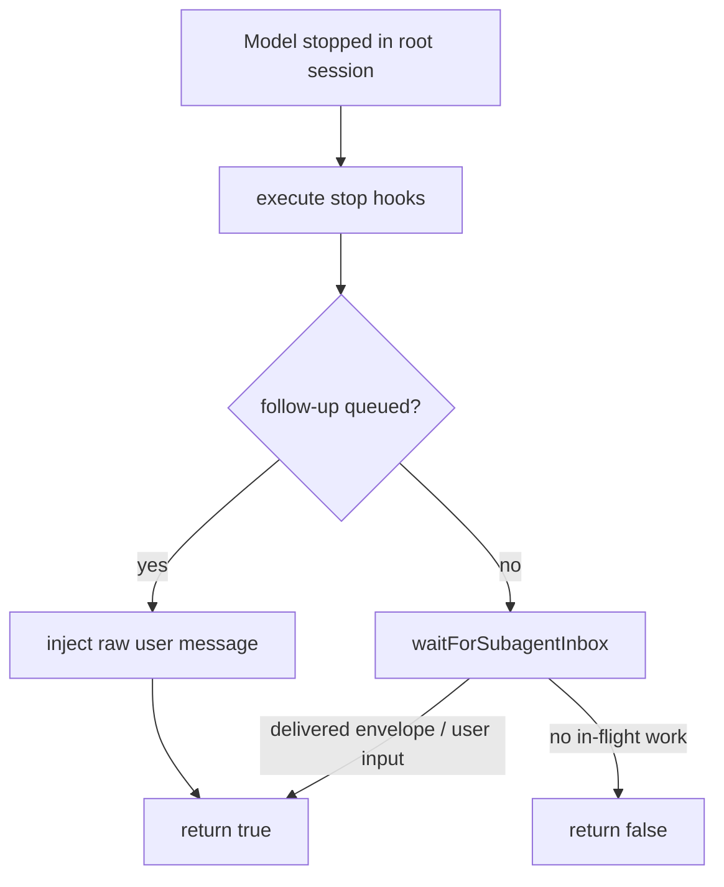
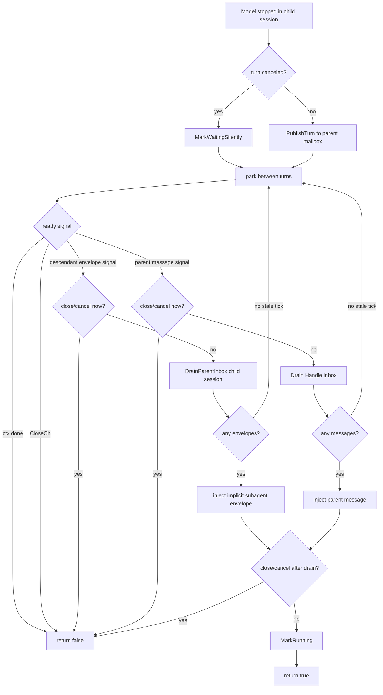
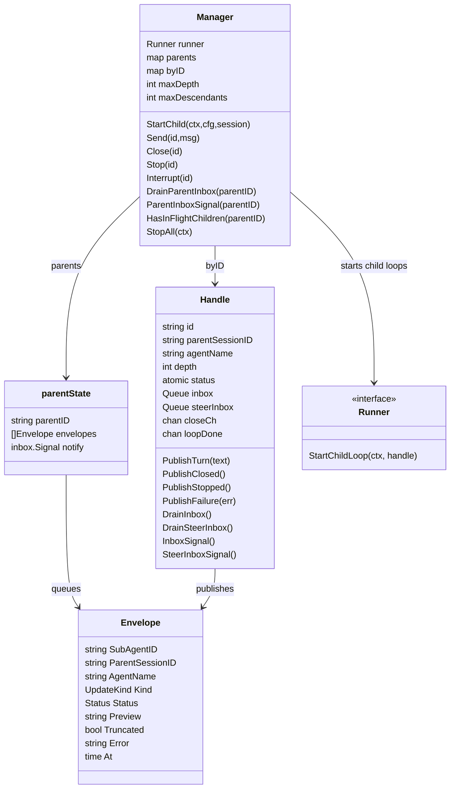
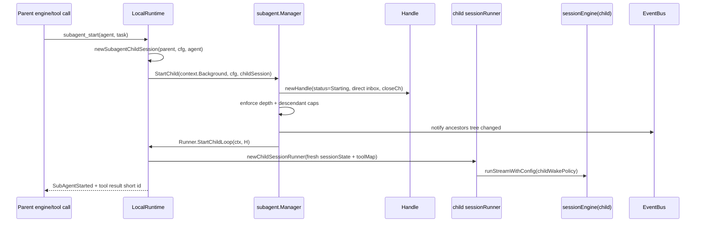
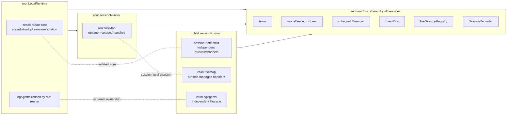
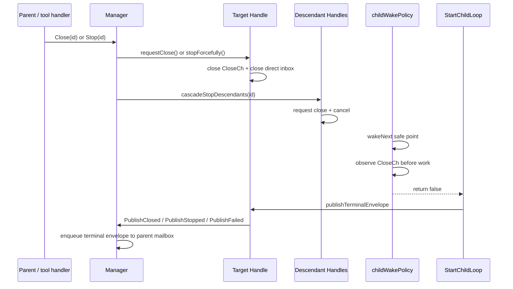
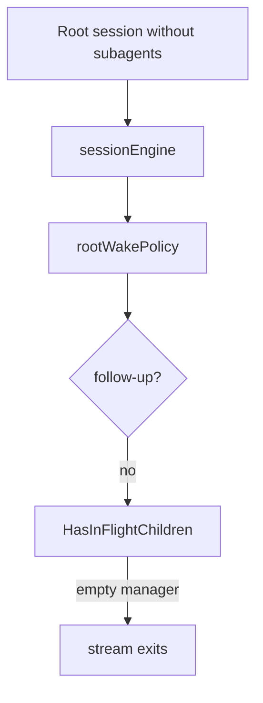

# Runtime / Subagent Architecture

This document captures the current runtime-managed subagent architecture after the runtime/subagent simplification pass. The design goal is one unified execution engine for both single-agent sessions and deeply nested subagent teams, with explicit wake policies and reliable envelope delivery.

## 1. High-level component topology



### Key ownership boundaries

- `runtimeCore` is shared by every session runner rooted in the same runtime: team, model/session stores, subagent manager, event bus, live registry, recorder.
- `sessionState` is unique per live engine loop: steer/follow-up queues, resume channels, elicitation channels, selected agent pin.
- `sessionRunner` is the first-class per-session driver. Root runners reuse the root `LocalRuntime`'s `bgAgents` handler so runtime shutdown can stop root background tasks; child runners allocate their own `bgAgents` and tool map so nested session dispatch stays isolated.
- `subagent.Manager` owns lifecycle state and mailboxes. It is runtime-agnostic and depends only on the narrow `subagent.Runner` interface.

## 2. Unified session execution loop

Both root sessions and subagent sessions enter through `sessionRunner.runStreamWithConfig`, then use `sessionEngine.run`. The difference is only the `wakePolicy`.



### Tool handler dispatch

Tool handlers are registered per `sessionRunner`, not on `LocalRuntime`. The internal `toolHandlerFunc` type (unexported) receives `*sessionRunner`, `*session.Session`, the tool call, and the event channel so handlers can launch nested sub-sessions through the active runner and therefore inherit the correct session-local coordination state. `publishTreeChangeFromChild` is the canonical helper for emitting tree-change events from child sessions.

### Root wake policy



### Child wake policy



Important invariants:

- Empty/stale wake signals never start a model turn.
- At a safe point, close/cancel wins over work; no extra turn starts after finalize/stop becomes observable.
- A child loop only calls `MarkRunning` after real work is injected and close/cancel is still not ready.

## 3. Subagent lifecycle and manager data model



### Start sequence



## 4. Envelope delivery across nested subagents

Subagent output is not pushed directly into all ancestors' transcripts. Instead, each subagent publishes an `Envelope` to its immediate parent's mailbox. The parent engine drains that mailbox at safe points and injects an implicit user message. Deep propagation is therefore hop-by-hop through live/waiting parents.

```mermaid
flowchart LR
    Leaf[Leaf subagent] -->|PublishTurn/Failure/Closed/Stopped| LeafHandle[Leaf Handle]
    LeafHandle -->|Envelope| ChildMailbox[Mailbox for middle child session]
    ChildMailbox -->|ParentInboxSignal| MiddlePolicy[Middle childWakePolicy]
    MiddlePolicy -->|DrainParentInbox middle| MiddleSession[Middle session transcript]
    MiddleSession -->|implicit user message + SubAgentUpdate| MiddleTurn[Middle next turn]
    MiddleTurn -->|PublishTurn| MiddleHandle[Middle Handle]
    MiddleHandle -->|Envelope| RootMailbox[Mailbox for root session]
    RootMailbox -->|waitForSubagentInbox| RootSession[Root session transcript]
```



### In-flight / deliverability semantics

```mermaid
flowchart TD
    Query[HasInFlightChildren(parentID)] --> PendingParent{parentID has queued envelopes?}
    PendingParent -->|yes| True[true]
    PendingParent -->|no| Children[scan direct children]

    Children --> ChildStatus{child status}
    ChildStatus -->|Starting / Running| True
    ChildStatus -->|Waiting| WaitingChecks{deliverable work?}
    ChildStatus -->|Closed / Stopped / Failed| Skip[skip subtree]

    WaitingChecks -->|direct inbox messages| True
    WaitingChecks -->|pending envelopes in child mailbox| True
    WaitingChecks -->|in-flight descendants reachable through child| True
    WaitingChecks -->|none| Continue[continue scan]

    Continue --> Children
    Skip --> Children
    Children -->|no match| False[false]
```

Critical rules:

- Already-queued envelopes count as work even if the producing child is now waiting or terminal.
- A waiting middle child with pending descendant envelopes remains in-flight because it can drain and propagate them upward.
- A terminal direct child isolates its subtree. Running grandchildren behind a terminal child do not keep ancestors alive because their delivery path is dead.
- `waitForSubagentInbox` opportunistically drains before checking in-flight status, preventing the parent from exiting while an envelope is already queued.

## 5. Event fan-out and persistence

```mermaid
flowchart TB
    Engine[sessionEngine events channel] --> Wrap[wrapEventsForObservers]
    Wrap --> External[RunStream returned event channel]
    Wrap --> Bus[EventBus.Publish(sessionID,event)]

    Bus --> TopicSubs[per-session subscribers\nTUI/API/attached tabs]
    Bus --> Snapshot[streaming snapshot\nfor late attachers]
    Bus --> Global[global observers]
    Global --> Recorder[SessionRecorder]

    Recorder --> Workers[per-session worker goroutines]
    Workers --> Store[session.Store]

    Manager[subagent.Manager listeners] --> TreeChanged[publishTreeChangeFromChild]
    TreeChanged --> Bus
```

Event handling properties:

- Per-session subscribers are non-blocking; slow subscribers drop events instead of stalling model/tool execution.
- The event bus maintains an in-progress streaming snapshot so late attachers can render the current partial response.
- The session recorder is a global observer and persists asynchronously through per-session workers.
- Subagent tree changes notify ancestors even if intermediate parents no longer drain their own inboxes.

## 6. Session runner/state split



Why this split matters:

- Root and child session runners share stores, event bus, live tree, subagent manager, and agent team definitions through `runtimeCore`.
- Root and child sessions do not share follow-up/steer/resume/elicitation coordination channels.
- Tool handlers are rebuilt per runner because closures need access to the active `*sessionRunner` for nested sub-session routing.
- `LocalRuntime` no longer owns a runtime-managed `toolMap`; the only root-only lifecycle handle it keeps is `bgAgents`.

## 7. Close, stop, and cascade behavior



Close/stop invariants:

- Finalize/close exits at the next safe point; no additional model turn starts after close is observable.
- Stop additionally cancels in-flight work.
- Cascade stop prevents orphaned descendant loops.
- `Manager.StopAll` requests closure/cancellation for all live handles and waits on each preallocated `loopDone` channel.

## 8. Single-agent mode



Single-agent overhead is intentionally minimal:

- The runtime still constructs `subagent.Manager`, `EventBus`, and `liveSessionRegistry`, but no subagent goroutines start unless a subagent tool is used or idle auto-finalize is enabled.
- After a stopped root turn, `HasInFlightChildren` scans an empty manager and exits immediately.
- Normal model/tool execution paths remain unchanged.

## 9. Steer / follow-up parity between user→root and parent→subagent

The runtime provides the same two delivery modes at both levels:

| Delivery mode | User → root session | Parent → child subagent |
|---|---|---|
| **Follow-up** (default) | Injected between turns via `sessionState.followUp` queue | Routed to `Handle.inbox` via `Manager.Send`; consumed by `childWakePolicy.wakeNext` between turns |
| **Steer** (mid-turn) | Drained from `sessionState.steer` queue after tool calls in `runOneTurn` | Routed to `Handle.steerInbox` via `Manager.Send`; drained by `childWakePolicy.drainMidTurn` at the same safe point |

All injected messages are plain user-role content — no wrapper (e.g. the historical `<system-reminder>` block) is applied. The distinction between steer and follow-up is purely about *when* the message reaches the session, not *how* it is formatted.

## 10. Robustness checklist

- One engine implementation (`sessionEngine`) for roots and subagents.
- Wake behavior isolated in `rootWakePolicy` and `childWakePolicy`.
- Stale wake signals re-park instead of triggering empty model turns.
- Close/cancel wins over work at child safe points.
- Pending envelopes are drained before parent exit decisions.
- Waiting middle children with descendant envelopes stay in-flight until delivery.
- Terminal middle children isolate unreachable subtrees.
- Depth and descendant caps bound recursion.
- Envelope queue coalesces noisy consecutive turn-completed updates and preserves terminal updates where possible.
- Direct inboxes and parent mailboxes use the shared `pkg/inbox` primitives.
- Event fan-out is non-blocking and recorder persistence is asynchronous.
