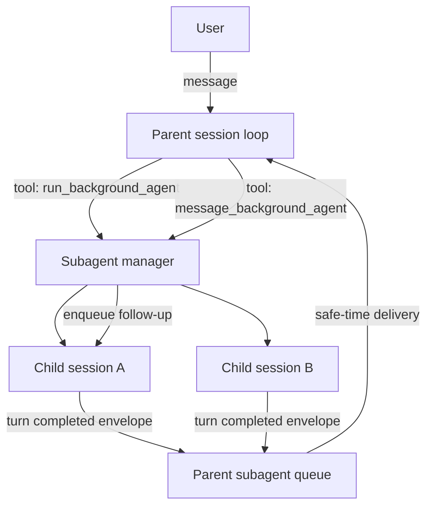
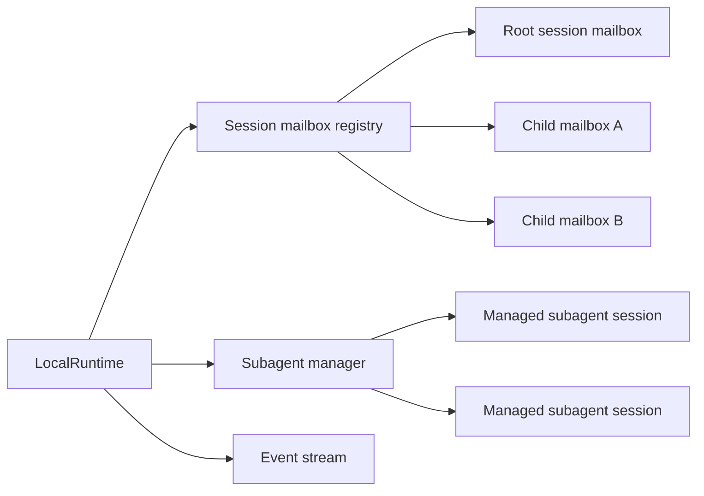
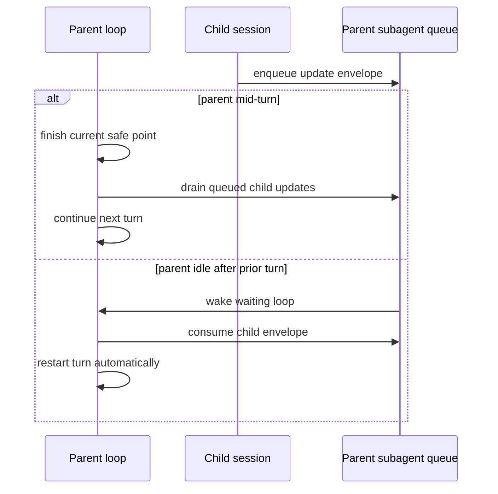

# Subagent Runtime Reimplementation Plan

## Goals

- Build a **runtime-native** subagent subsystem with **session-per-subagent** semantics.
- Support **parallel background subagents** with **parent wakeups** on child updates.
- Support **back-and-forth parent/subagent conversations** without polling.
- Keep the design **observable**, **extensible**, and **testable**.
- Ignore TUI/client UX for now, but emit the runtime events and APIs they will need later.

## Delivery strategy

### Queueing / delivery strategy

We will implement a **hybrid subagent delivery envelope** instead of choosing between:

1. **Signal-only** (`subagent X responded`) and
2. **Full child assistant message**.

Why hybrid:

- signal-only is too weak: parent must immediately burn a tool call just to know whether the child finished, failed, or asked a question;
- full-message delivery is too noisy: long child outputs can derail the parent mid-task and waste context.

**Chosen approach:** deliver a small runtime-generated envelope containing:

- child session ID
- child agent name
- child status (`waiting`, `failed`, `stopped`, `closed`)
- a short preview of the last assistant message (truncated)
- a reminder that the parent can inspect or reply using runtime-managed subagent tools

This gives the parent enough context to act immediately while preserving context budget.

## Mermaid diagrams

### High-level flow

### Runtime composition

### Safe-time wakeup behavior

## Implementation checklist

- [x] Add runtime design documentation for the new subagent subsystem.
- [x] Introduce session-scoped mailboxes for:
  - [x] parent/subagent update delivery
  - [x] parent wakeups / safe-time restart
  - [x] parent→child messaging via per-handle inbox
  - user steer and user follow-up remain on the root runtime (no scope change needed for this iteration)
- [x] Introduce a runtime-native subagent manager that tracks:
  - [x] managed child sessions
  - [x] parent/child relationships
  - [x] session status/lifecycle
  - [x] parent wakeup routing
- [x] Add runtime events for subagent lifecycle / turn completion / observability
      (`subagent_started`, `subagent_sent`, `subagent_update`).
- [x] Add a compact runtime-generated envelope for child-to-parent delivery
      (`<subagent_update>` with id, agent, kind, status, preview, optional error).
- [x] Implement runtime-managed subagent tools (`subagent_start`, `subagent_send`,
      `subagent_list`, `subagent_inspect`, `subagent_close`, `subagent_stop`).
      Legacy `run_background_agent` / `transfer_task` / `handoff` remain untouched
      for backward compatibility; new tools are registered on the runtime but
      not yet auto-exposed to every agent config.
- [x] Add parent→child conversation support (`subagent_send`).
- [x] Ensure root sessions restart automatically when child updates arrive after parent stop.
- [x] Ensure mid-turn child updates are only delivered at safe points.
- [x] Keep child sessions alive for back-and-forth until explicitly closed/stopped or terminal failure.
- [x] Keep existing persistence behavior correct for root sessions
      (subagent events are session-scoped; `PersistentRuntime` already filters
      by session id).
- [x] Add tests for:
  - [x] parent wakeup after child update
  - [x] safe-time delayed delivery while parent mid-turn
  - [x] parallel child sessions / isolation across parents
  - [x] parent→child messaging
  - [x] lifecycle/status transitions (close/stop/failed via manager)
  - [x] runtime envelope formatting
- [x] Run targeted tests (`go test ./pkg/subagent/... ./pkg/runtime/...`).
- [x] Run broader runtime/tooling tests (`go test ./...`).
- [x] Review and document remaining risks / deferred client work
      (see `docs/design/subagent-runtime.md`).

## Expected non-goals for this change

- TUI/session tree UX
- deep API exposure for steering nested sessions from external clients
- remote-runtime parity beyond compile safety
- fully replacing legacy `transfer_task`/`handoff` semantics in this pass
