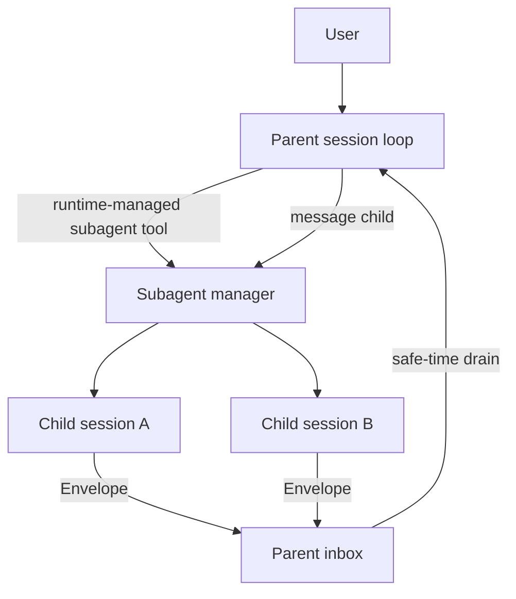
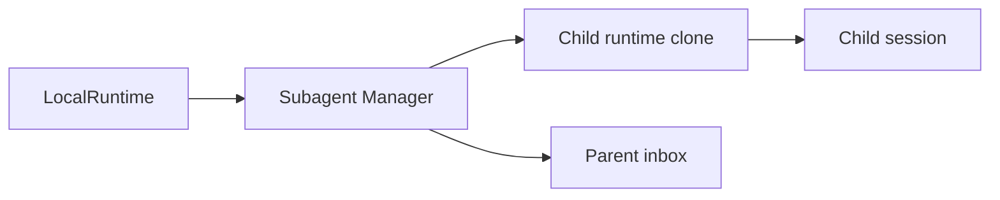
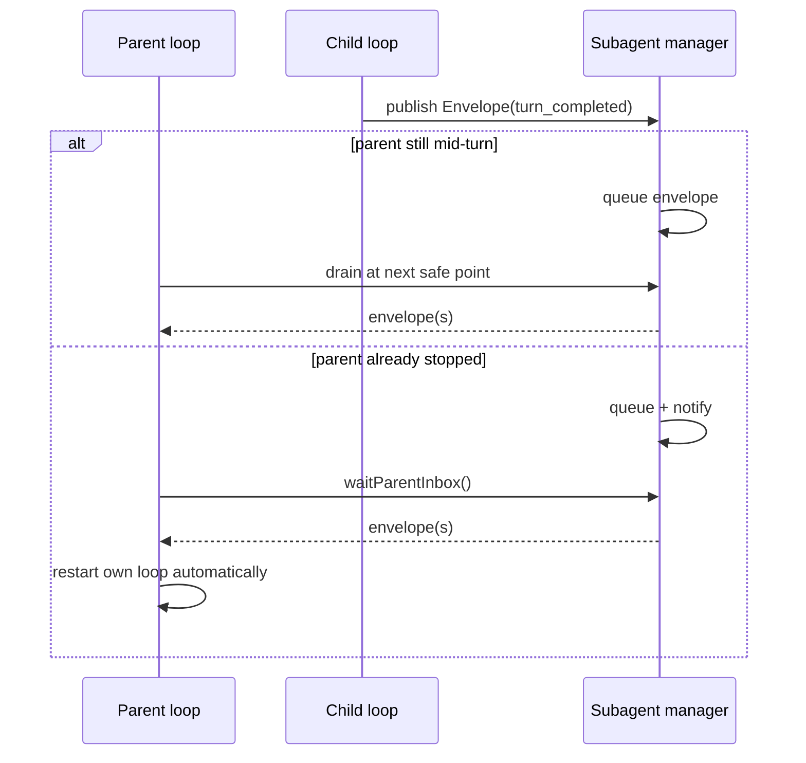

# Runtime-managed subagents

This document describes the **runtime-native** subagent subsystem introduced for docker-agent.

It intentionally focuses on the **core runtime** and avoids client-specific UX decisions.

## Goals

- each subagent always has its **own session**
- subagents can run **in parallel**
- parent and child can have **back-and-forth conversations**
- a child can **wake its parent** without polling
- child updates are delivered only at **safe points** in the parent loop
- the implementation is modular enough to support future **deterministic workflows**

## Key design decision: compact runtime envelope

There were two obvious options for child-to-parent delivery:

1. signal only: `subagent(id) responded`
2. full child assistant message

We implemented a **hybrid envelope** instead.

Each child publishes a small runtime-generated payload containing:

- subagent/session id
- parent session id
- child agent name
- update kind (`turn_completed`, `closed`, `stopped`, `failed`)
- status snapshot
- short preview of the latest assistant message
- optional error detail

This gets the best trade-off:

- **better than signal-only** because the parent can often act immediately
- **safer than full-message injection** because long child output does not bloat or derail the parent context

The envelope is then rendered into an implicit user-role message inside the parent session as:

```xml
<subagent_update>
...
</subagent_update>
```

## Architecture

### High level



### Main components



### Parent wakeup flow



## Core model

### Manager

`pkg/subagent.Manager` owns:

- a registry of children by subagent id
- a registry of parent states by parent session id
- a per-parent inbox of envelopes
- notification channels used by parents waiting for child updates

### Handle

Each subagent has a `Handle` that owns:

- child session pointer
- status (`starting`, `running`, `waiting`, `closed`, `stopped`, `failed`)
- child inbox for parent→child messages
- close signal
- preview / error / last-update metadata

### Child runtime isolation

Each child loop runs on a **runtime clone** created by `LocalRuntime.newChildLoopRuntime()`.

This is critical.

Without it, child loops would share:

- resume channels
- steer/follow-up queues
- elicitation channels

with the parent runtime, which would be unsafe under concurrency.

The clone shares durable/immutable dependencies like:

- team
- model store
- session store
- runtime config knobs
- subagent manager

but gets fresh transient coordination state.

## Safe-time semantics

Child envelopes are injected into the parent at exactly two places:

1. **mid-turn safe point**: after tool execution, alongside steer-message draining
2. **post-stop wait**: if the parent turn ended but some child is still in-flight

This preserves ordering and avoids corrupting streamed chat state.

## Waiting vs in-flight

A subtle but important distinction:

- **live child**: not terminal (`starting`, `running`, `waiting`)
- **in-flight child**: may still autonomously produce a future envelope

`waiting` children are not considered in-flight **unless they already have queued inbox work**.

That prevents the parent from hanging forever waiting on children that are merely idle.

## Event model

The runtime now emits:

- `subagent_started`
- `subagent_sent`
- `subagent_update`

These are runtime-level observability hooks and intentionally client-agnostic.

## Current scope

Implemented now:

- core manager
- child runtime isolation
- parent inbox / wakeup behavior
- parent→child messaging primitives
- compact envelope delivery
- runtime-managed subagent tool definitions and handlers
- runtime tests and unit tests

Intentionally *not* auto-wired into all agent configs yet:

- legacy multi-agent prompting behavior remains unchanged
- legacy `transfer_task` / `handoff` behavior remains intact
- client UX is deferred

This preserves backward compatibility while the runtime core is validated.

## Future work

- explicit API/server exposure for nested-session steering by users
- richer inspect/query tools over child session history
- deterministic workflow builders on top of the manager
- client-side session tree / observability UX
- opt-in or config-driven exposure of runtime-managed subagent tools in agent configs
